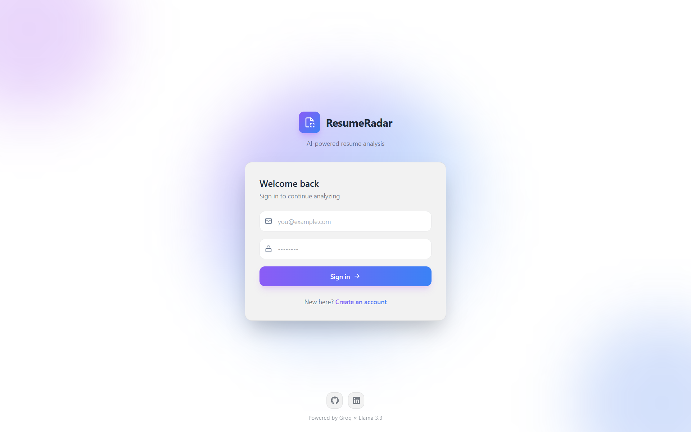

# ResumeReader

An AI-powered resume analyzer that compares your resume against any job description and returns a match score, matched skills, and skill gaps — instantly.



---

### > 🔗 **Live Demo:** http://54.173.200.60/login
---

## Features

- 📄 Upload your resume as a PDF
- 📋 Paste any job description
- 🤖 AI analyzes the match using Llama 3.3 70B via Groq
- 📊 Get a 0–100 match score
- ✅ See matched skills at a glance
- ❌ Identify skill gaps to work on
- 🔐 JWT authentication — your analyses are private
- 📁 Analysis history saved per user
- 🐳 Fully Dockerized — runs anywhere

---

## Tech Stack

### Frontend


### Backend


### AI


### DevOps


---

## Architecture

```
┌─────────────────┐         ┌─────────────────────────────────────┐
│                 │  HTTPS  │           Express Backend           │
│  React Frontend │ ──────► │  /api/auth  →  authController       │
│  (Vite + nginx) │         │  /api/resumes → resumeController    │
│                 │         │       │              │              │
└─────────────────┘         │   authMiddleware   pdfParser        │
                            │       │              │              │
                            │   JWT verify    aiOrchestrator      │
                            │                     │               │
                            └─────────────────────┼───────────────┘
                                                  │
                                    ┌─────────────┼─────────────┐
                                    │             │             │
                                 MongoDB      Groq API        AWS S3
                                 (Atlas)     (Llama 3.3)      (EC2)
```

---

## How It Works

1. User registers/logs in → JWT token issued and stored in localStorage
2. User uploads a PDF resume + pastes a job description
3. Backend extracts text from PDF using `pdf-parse`
4. Resume text + JD sent to Llama 3.3 70B via Groq API
5. AI returns structured JSON: `{ score, matchedSkills, gaps }`
6. Result saved to MongoDB and returned to frontend
7. Frontend renders score ring, matched skills, and gap tags with animations

---

## Project Structure

```
ResumeReader/
├── backend/
│   ├── src/
│   │   ├── controllers/
│   │   │   ├── authController.js      # register, login
│   │   │   └── resumeController.js    # analyze, history, delete
│   │   ├── middleware/
│   │   │   └── authMiddleware.js      # JWT verification
│   │   ├── models/
│   │   │   ├── User.js                # email, passwordHash
│   │   │   └── Analysis.js            # score, skills, gaps
│   │   ├── routes/
│   │   │   ├── authRoutes.js          # POST /login, /register
│   │   │   └── resumeRoutes.js        # analyze, history, delete
│   │   ├── services/
│   │   │   ├── aiOrchestrator.js      # Groq API + prompt
│   │   │   └── pdfParser.js           # PDF → plain text
│   │   └── server.js
│   ├── Dockerfile
│   └── .env.example
├── frontend/
│   ├── src/
│   │   ├── pages/
│   │   │   ├── Login.jsx              # auth form
│   │   │   ├── Upload.jsx             # PDF + JD input
│   │   │   └── Results.jsx            # score + skills display
│   │   ├── components/
│   │   │   ├── Nav.jsx                # navbar with theme switcher
│   │   │   └── ScoreRing.jsx          # animated SVG score ring
│   │   ├── AuthContext.jsx            # JWT auth state
│   │   ├── client.js                  # API helper with auth headers
│   │   └── App.jsx                    # routes + protected routes
│   ├── nginx.conf                     # proxies /api to backend
│   ├── Dockerfile
│   └── .env.example
└── docker-compose.yml
```

---

## Getting Started

### Prerequisites

- Node.js v20+
- Docker + Docker Compose
- MongoDB Atlas account (free tier)
- Groq API key (free at console.groq.com)

### Run with Docker (recommended)

```bash
# 1. Clone the repo
git clone https://github.com/yourusername/ResumeReader.git
cd ResumeReader

# 2. Set up backend environment
cp backend/.env.example backend/.env
# Fill in your values in backend/.env

# 3. Start everything
docker-compose up --build
```

Open `http://localhost` — done.

### Run locally without Docker

```bash
# Backend
cd backend
npm install
npm run dev

# Frontend (new terminal)
cd frontend
npm install
npm run dev
```

---

## Environment Variables

Create `backend/.env`:

```env
MONGO_URI=mongodb+srv://<user>:<password>@cluster.mongodb.net/resume
JWT_SECRET=your_super_secret_key
GROQ_API_KEY=your_groq_api_key
PORT=5001
```

---

## API Reference

| Method | Endpoint | Auth | Description |
|--------|----------|------|-------------|
| POST | `/api/auth/register` | No | Create account, returns JWT |
| POST | `/api/auth/login` | No | Login, returns JWT |
| POST | `/api/resumes/analyze` | Yes | Analyze resume vs JD |
| GET | `/api/resumes/history` | Yes | Get past analyses |
| DELETE | `/api/resumes/delete/:id` | Yes | Delete one analysis |
| DELETE | `/api/resumes/deleteAll` | Yes | Clear all history |

---

## Sample AI Response

```json
{
  "score": 92,
  "matchedSkills": ["React.js", "Node.js", "Python", "MongoDB", "Git", "TensorFlow"],
  "gaps": ["TypeScript", "AWS", "Docker", "PostgreSQL"]
}
```

---

## Roadmap

- [ ] AWS EC2 deployment + custom domain
- [ ] GitHub Actions CI/CD pipeline
- [ ] Cover letter generation
- [ ] Resume bullet point rewriter
- [ ] History page with past analyses
- [ ] RAG layer for smarter matching

---

## Author

**Sidharth Gopan**
BTech CSE — Rajagiri School of Engineering and Technology

[](https://linkedin.com/in/sidharthgopan)

---

## License

MIT License — feel free to use this project as inspiration for your own.
